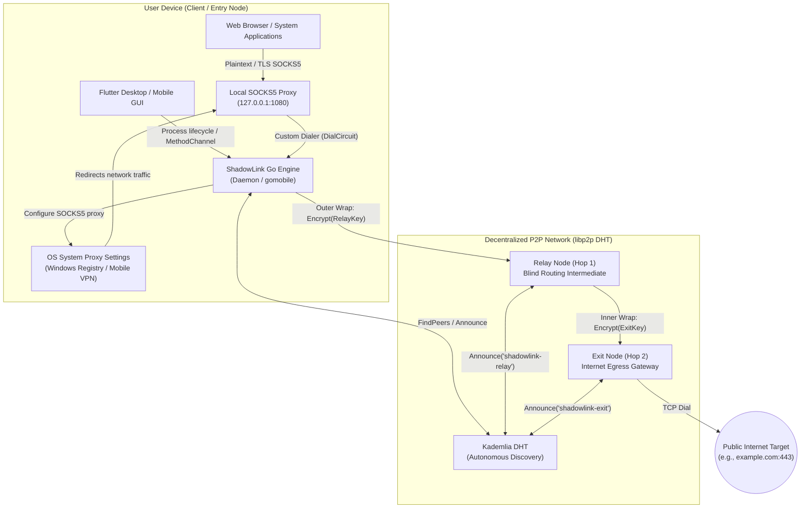
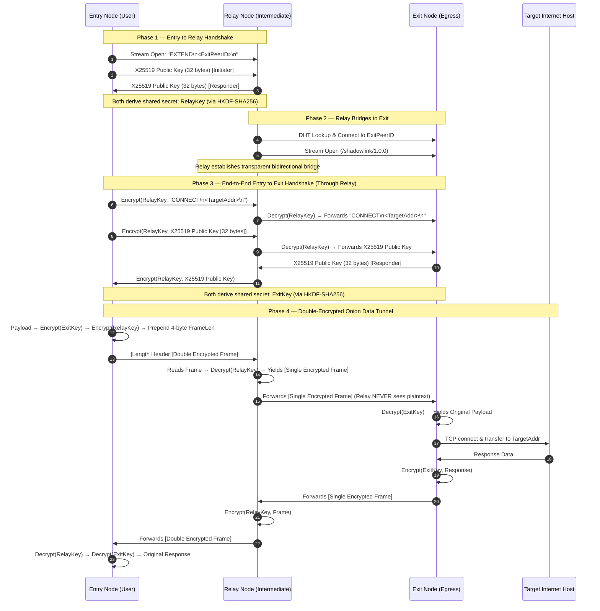
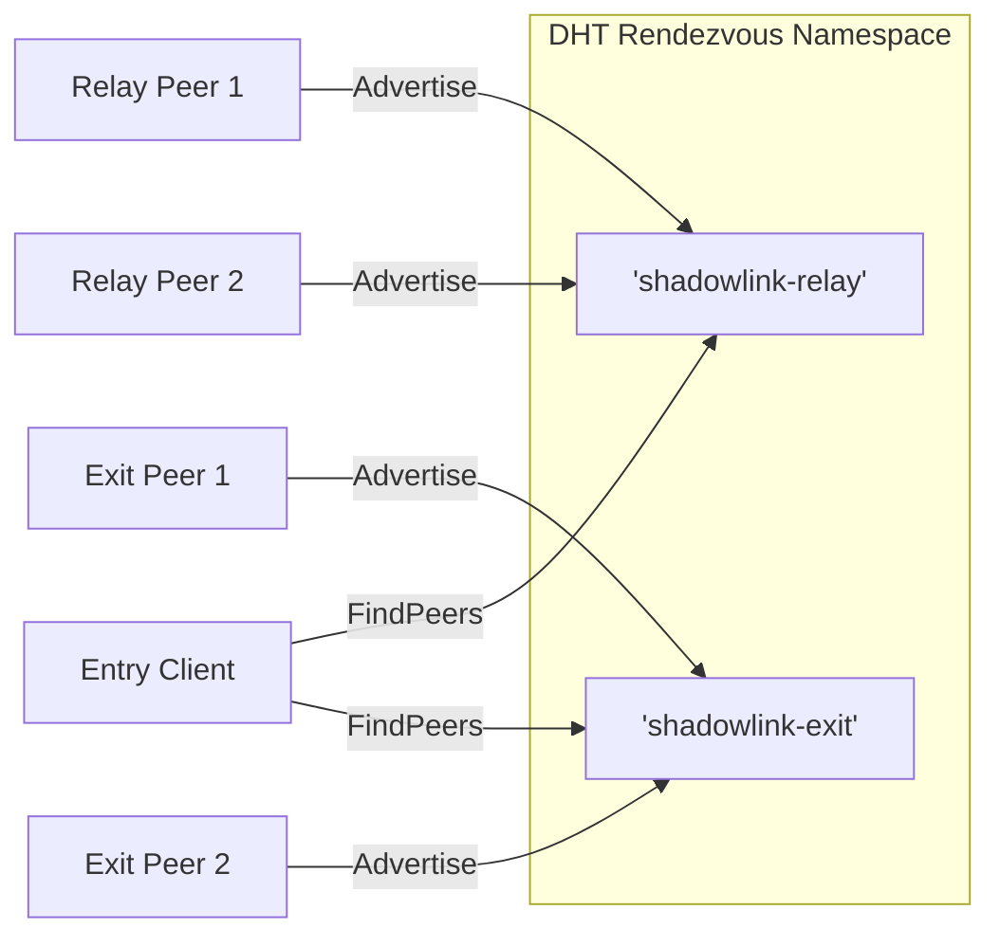
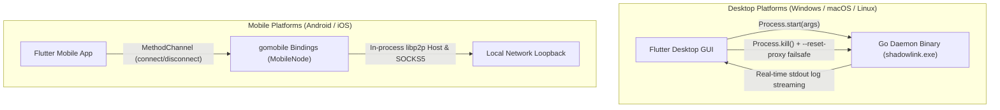

# 🏛️ ShadowLink System Architecture

ShadowLink is a **Decentralized Virtual Private Network (dVPN)** engineered on `libp2p` peer-to-peer networking, ephemeral **X25519 ECDH** session derivation, and **XChaCha20-Poly1305** multi-hop layered onion routing. All network participants operate as autonomous peers without reliance on centralized directory authorities or tracking servers.

---

## 1. System Overview



---

## 2. True Onion Routing: Circuit Negotiation Protocol

Every connection generates independent, ephemeral **X25519 ECDH** key pairs with **HKDF-SHA256** domain separation. Forward secrecy is absolute: keys are never written to disk or reused across circuits.



---

## 3. Node Roles & Responsibilities

| Role | CLI Flag | Functionality | Cryptographic Visibility |
|---|---|---|---|
| **Entry Node** | `--entry` | Runs local SOCKS5 proxy (`127.0.0.1:1080`); wraps data with `[ExitKey, RelayKey]`. | Knows User IP and Relay IP. Does not expose target to Relay. |
| **Relay Node** | `--relay` | Accepts `EXTEND` requests; bridges traffic to the designated Exit node. | Knows Entry IP and Exit IP. **Cannot read traffic payload or target destination.** |
| **Exit Node** | `--exit` | Accepts `CONNECT` requests; dials target host on the public internet. | Knows Target Host and Relay IP. **Does not know User IP.** |
| **System Proxy** | `--sysproxy` | Directs OS-wide TCP traffic to local SOCKS5 proxy via Windows Registry. | Client OS automation only. |

---

## 4. Serverless Peer Discovery (Kademlia DHT)



1. **Bootstrap Phase**: The node dials multiaddresses of well-known decentralized seed peers (`DefaultBootstrapPeers`).
2. **Advertisement Phase**: Relays and Exits advertise their respective roles to the Kad-DHT routing table.
3. **Discovery Phase**: Entry nodes query the DHT for active peers, shuffle results using Fisher-Yates randomization to eliminate traffic analysis bias, and dial circuits on demand.

---

## 5. Layered Cryptographic Encapsulation

```
┌────────────────────────────────────────────────────────┐
│ Outer Layer: Entry ↔ Relay Hop                         │
│ Cipher: XChaCha20-Poly1305 AEAD                        │
│ Key: RelayKey (X25519 ECDH + HKDF-SHA256)              │
│ ┌────────────────────────────────────────────────────┐ │
│ │ Inner Layer: Entry ↔ Exit End-to-End Hop           │ │
│ │ Cipher: XChaCha20-Poly1305 AEAD                    │ │
│ │ Key: ExitKey (X25519 ECDH + HKDF-SHA256)           │ │
│ │ ┌────────────────────────────────────────────────┐ │ │
│ │ │ Plaintext Application Payload                  │ │ │
│ │ │ (HTTP/HTTPS, SOCKS5 TCP Stream)                │ │ │
│ │ └────────────────────────────────────────────────┘ │ │
│ └────────────────────────────────────────────────────┘ │
└────────────────────────────────────────────────────────┘
```

### Framing & Zero-Allocation Memory Model
All frames transmitted through `libP2PConn` follow a strict binary layout:
```
[4 Bytes Big-Endian Length Prefix][N Bytes XChaCha20-Poly1305 Ciphertext + 16 Byte Tag]
```
- **Max Frame Cap**: Individual frames are capped at `MaxFrameSize` (128 KiB) to prevent Out-Of-Memory (OOM) DoS attacks.
- **Zero Allocations on Read**: The connection wrapper reuses a pre-allocated internal buffer (`frameBuf`), preventing garbage collection thrashing during sustained high-bandwidth operations.

---

## 6. GUI Control Plane & Lifecycle Management



---

## 7. Component Map

```
cmd/shadowlink/main.go            # Daemon CLI entrypoint, flag parsing, signal handling & EULA
internal/
  config/config.go                # Centralized protocol constants, rendezvous keys, port defaults
  crypto/
    ecdh.go                       # Ephemeral X25519 key negotiation & HKDF-SHA256 derivation
    encryption.go                 # XChaCha20-Poly1305 AEAD encryption & decryption
  discovery/dht.go                # libp2p host instantiation, Kad-DHT routing, peer discovery
  network/
    circuit.go                    # Circuit builder (3-hop via relay, 1-hop direct), libP2PConn framing
    handler.go                    # Protocol dispatcher (EXTEND relaying & CONNECT exit proxying)
  onion/onion.go                  # Recursive multi-layer encryption wrap & unwrap logic
  socks5/server.go                # RFC 1928 SOCKS5 proxy server with custom onion dialer
  sysproxy/
    sysproxy_windows.go           # Windows registry system proxy automation (HKCU)
    sysproxy_other.go             # Non-Windows fallback stub
mobile/shadowlink.go              # gomobile exported MobileNode interface for iOS and Android
shadowlink_gui/lib/               # Flutter cross-platform UI with cyber aesthetic
```
