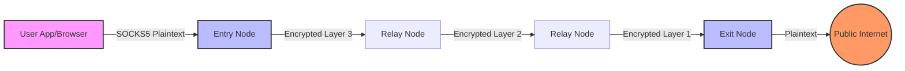
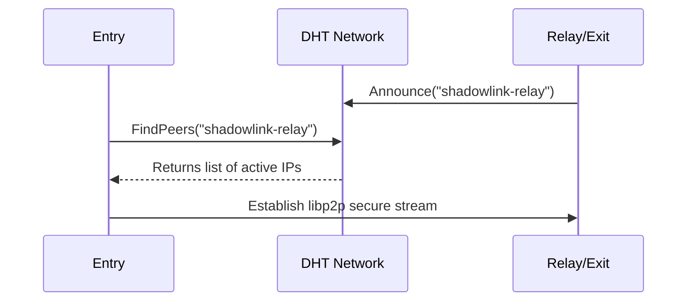
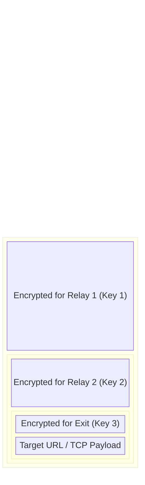

# ShadowLink Architecture

ShadowLink operates as a decentralized, peer-to-peer Virtual Private Network. It utilizes **Multi-hop Onion Routing** for extreme privacy and a **Kademlia Distributed Hash Table (DHT)** for serverless node discovery.

## 1. High-Level Network Topology

The network consists of unified Nodes that can act in three capacities:
- **Entry Node (Client)**: Exposes a local SOCKS5 proxy to the user's OS and routes traffic into the dVPN.
- **Relay Node**: Receives encrypted traffic from one node and blindly forwards it to the next.
- **Exit Node**: Decrypts the final layer of traffic and forwards the raw TCP/UDP request to the public internet.

## 2. Serverless Node Discovery (DHT)

Traditional VPNs rely on central servers to track which nodes are online. ShadowLink uses `libp2p`'s DHT.

1. When a node starts as a `relay` or `exit`, it announces its presence to the DHT using a rendezvous string (e.g., `shadowlink-relay`).
2. When an `entry` node needs to build a circuit, it queries the DHT for nodes announcing those rendezvous strings.

## 3. Onion Routing (Cryptography)

To ensure that no single node knows both the User's IP and the Destination IP, traffic is wrapped in layers of **XChaCha20-Poly1305** encryption.

### Circuit Building
The Entry Node generates three ephemeral symmetric keys and negotiates them with the selected path nodes (mechanism pending full implementation, traditionally via ECDH like X25519).

### Payload Encryption
When sending a packet, the Entry Node encrypts it multiple times, from the exit node back to the first relay.

As the packet travels, each node peels off exactly one layer of encryption:
- **Relay 1** peels layer 1, revealing layer 2 (destined for Relay 2). It does not know the final destination.
- **Relay 2** peels layer 2, revealing layer 3 (destined for Exit). It does not know who the original sender was.
- **Exit** peels layer 3, revealing the plaintext payload. It does not know who the original sender was.
