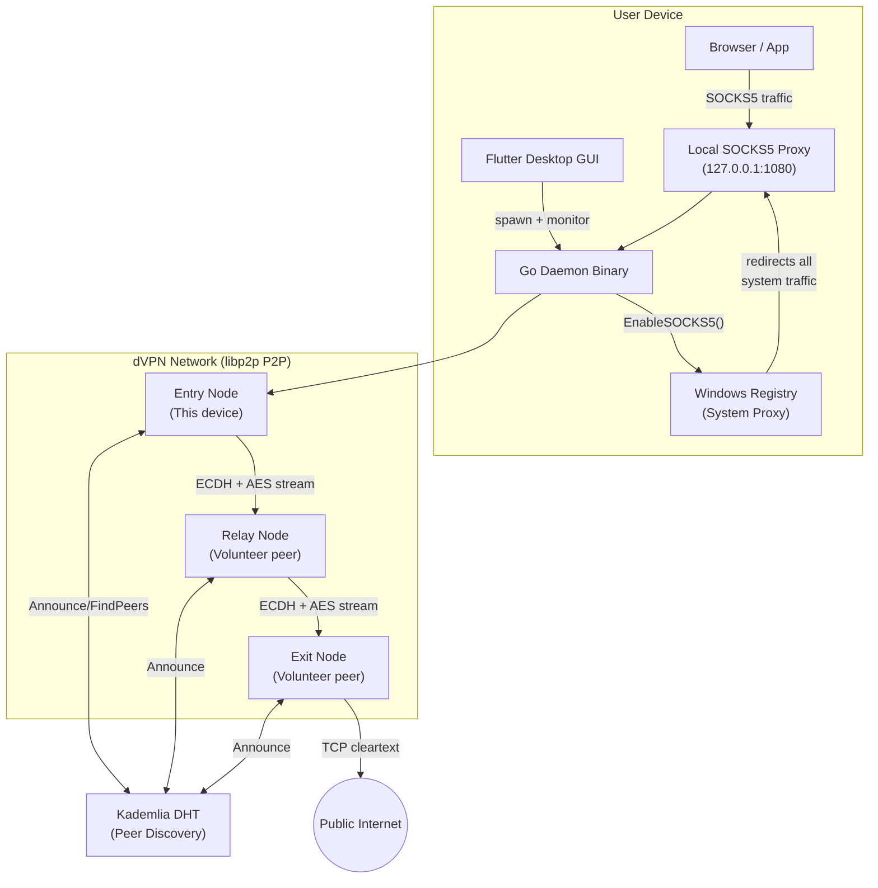
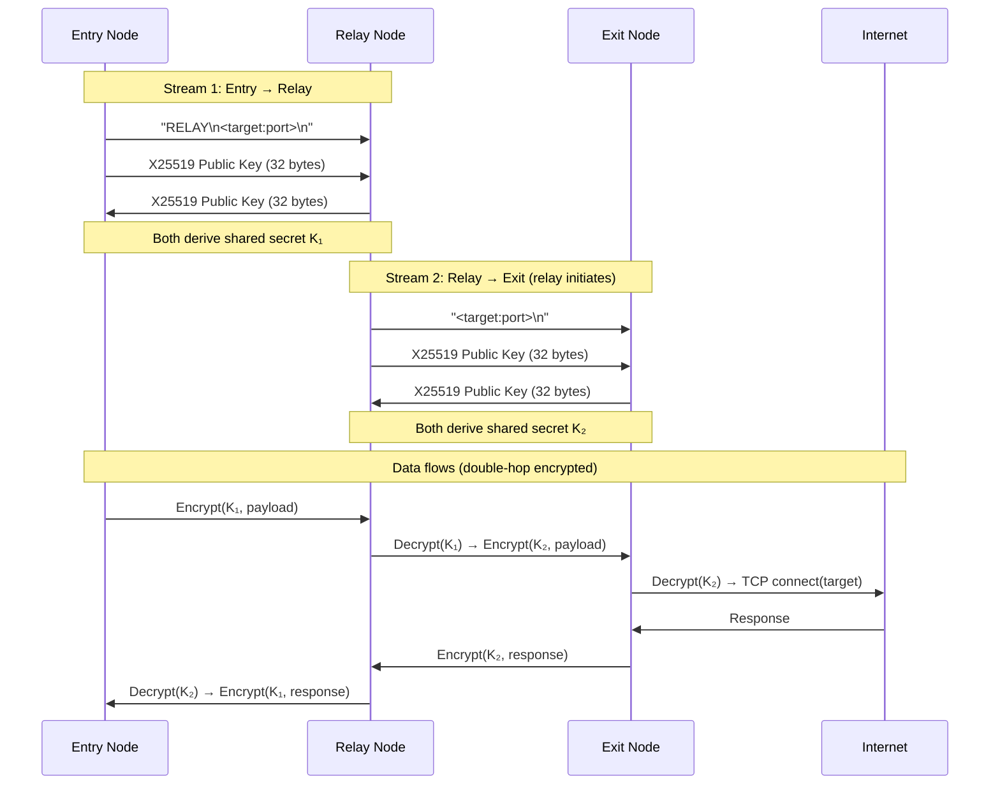
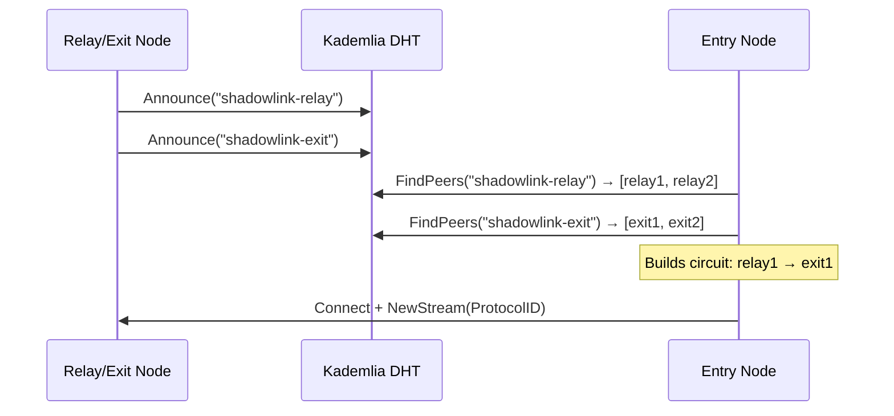
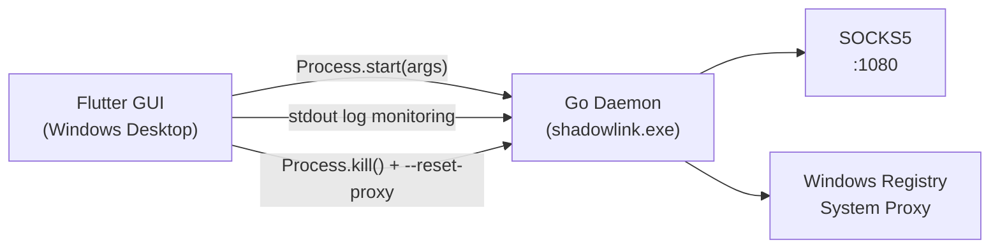

# ShadowLink Architecture

ShadowLink is a **decentralized VPN (dVPN)** built on libp2p P2P networking and XChaCha20-Poly1305 onion routing. All nodes are equal peers — there are no central servers or coordination points.

---

## 1. System Overview



---

## 2. Circuit Negotiation Protocol

Every connection uses **ephemeral X25519 ECDH** — no session key is ever reused.



---

## 3. Node Roles

A single binary can run as any combination of roles simultaneously:

| Flag | Role | Behaviour |
|---|---|---|
| `--entry` | Entry Node | Opens local SOCKS5 proxy; routes browser traffic into dVPN |
| `--relay` | Relay Node | Accepts streams; bridges Entry→Exit with re-encryption |
| `--exit` | Exit Node | Connects to real internet target; proxies cleartext traffic |
| `--sysproxy` | (modifier) | Configures Windows registry to route all system traffic |

---

## 4. Serverless Peer Discovery (DHT)



Bootstrap nodes seed the initial DHT connection (public libp2p/IPFS peers).
After bootstrapping, node discovery is fully decentralized.

---

## 5. Encryption Stack

```
┌─────────────────────────────────────────────┐
│              Entry→Relay Tunnel              │
│   XChaCha20-Poly1305  key=K₁ (ECDH-X25519)  │
│  ┌───────────────────────────────────────┐  │
│  │           Relay→Exit Tunnel           │  │
│  │  XChaCha20-Poly1305  key=K₂           │  │
│  │  ┌─────────────────────────────────┐  │  │
│  │  │    Plaintext TCP Payload        │  │  │
│  │  │    (e.g. TLS to example.com)    │  │  │
│  │  └─────────────────────────────────┘  │  │
│  └───────────────────────────────────────┘  │
└─────────────────────────────────────────────┘
```

Each hop peels one encryption layer:
- **Relay** decrypts with K₁, re-encrypts with K₂ — never sees plaintext
- **Exit** decrypts with K₂, sees plaintext — never knows the entry IP

Every frame is prefixed with a **4-byte big-endian length header** to prevent TCP partial-read decryption corruption.

---

## 6. GUI ↔ Daemon IPC



The Flutter GUI manages the Go binary as a child process. On abnormal exit,
Flutter invokes `shadowlink.exe --reset-proxy` as a failsafe to restore
the Windows system proxy to its original state, preventing a "broken internet" scenario.

---

## 7. File Structure

```
cmd/shadowlink/main.go          ← Entrypoint, flags, EULA, signal handling
internal/
  crypto/
    encryption.go               ← ChaCha20-Poly1305 Encrypt/Decrypt/GenerateKey
    ecdh.go                     ← X25519 PerformECDH / RespondECDH
  discovery/dht.go              ← libp2p host + KadDHT Announce/FindPeers
  network/
    circuit.go                  ← DialCircuit: 3-hop routing with ECDH + framing
    handler.go                  ← HandleStream: relay forwarding + exit proxying
  onion/onion.go                ← WrapPayload / UnwrapPayload (layered AEAD)
  socks5/server.go              ← Local SOCKS5 server (entry node only)
  sysproxy/
    sysproxy_windows.go         ← Windows registry proxy management
    sysproxy_other.go           ← no-op stub for macOS/Linux
shadowlink_gui/lib/
  main.dart                     ← App entrypoint → EulaScreen
  screens/eula_screen.dart      ← EULA enforcement (mandatory, non-skippable)
  screens/dashboard_screen.dart ← Connect/Disconnect + role toggles
  services/daemon_service.dart  ← Go binary lifecycle management
  theme/app_theme.dart          ← Design system (Deep Obsidian + Neon Cyan)
```
