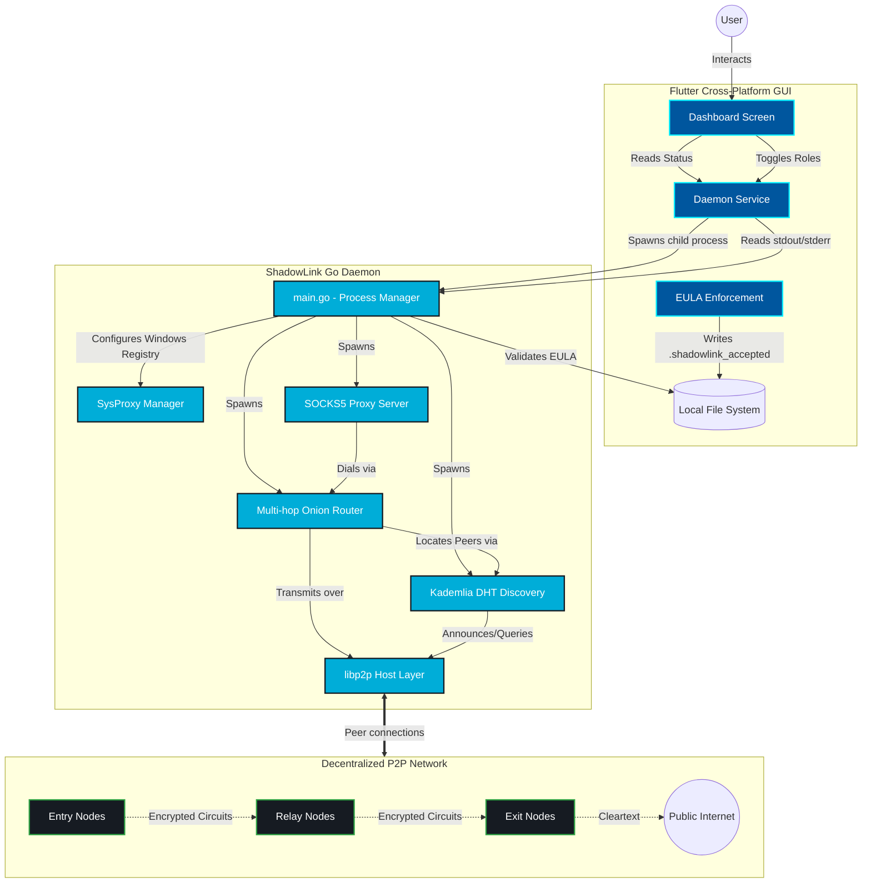

# ShadowLink v2 Architecture

Below is the high-level architecture diagram detailing how the Flutter GUI (v2), the Go Daemon, and the P2P Network interact.

### Component Breakdown
1. **Flutter GUI**: Operates entirely in user-space, providing the visual interface. It acts as an orchestrator, spawning the Go binary in the background and monitoring its `stdout`.
2. **Go Daemon**: The powerhouse of the application. It runs the libp2p node, handles multiplexed streams, wraps TCP in SOCKS5, and modifies system proxy settings.
3. **P2P Network**: The decentralized layer where traffic is bounced through relays before exiting to the clearnet.
