# ShadowLink 🛡️


> **Local Double-Encryption Secure Tunnel with Ephemeral Keys**

ShadowLink is a specialized, local-only VPN tunnel designed for maximum privacy and security. Unlike standard VPN clients, ShadowLink runs a local encrypted loopback (Client → Server) on your machine, ensuring that your traffic is double-encrypted before it even hits your network card or upstream VPN (like ProtonVPN).

## 🚀 Features

-   **Double Encryption**:
    -   **Layer 1**: ShadowLink (AES-256-GCM) - Encryption happens *inside* your User Space.
    -   **Layer 2**: Your System VPN (e.g., ProtonVPN, NordVPN, etc.) - Encryption happens at the Network Interface level.
-   **Maximum Security Protocol**:
    -   **AES-256-GCM**: Military-grade encryption for the data payload.
    -   **X25519 (Curve25519)**: Ephemeral Elliptic Curve Diffie-Hellman Key Exchange.
    -   **Forward Secrecy**: A unique, random session key is generated for **every single connection**. Keys exist only in RAM and are wiped on disconnect.
-   **Strict Mode (Kill Switch)**:
    -   Optionally blocks traffic if it detects your public IP matches your ISP's IP (prevents accidental leaks if your VPN drops).
-   **System-Wide Proxy (New)**:
    -   Automatically routes **ALL** Windows applications (Chrome, Edge, etc.) through ShadowLink with a single toggle. No manual browser config needed.
-   **Cyber-Aesthetic GUI**:
    -   Built with `customtkinter` for a modern, dark-mode "hacker" aesthetic.
    -   Real-time bandwidth visualization.

## 🏗️ Architecture


### Data Flow Diagram

```mermaid
graph TD
    %% Professional Corporate Theme
    classDef userNode fill:#2c3e50,stroke:#34495e,stroke-width:2px,color:#ecf0f1;
    classDef shadowLink fill:#2980b9,stroke:#3498db,stroke-width:2px,color:#fff;
    classDef checkNode fill:#f39c12,stroke:#e67e22,stroke-width:2px,color:#fff;
    classDef vpnNode fill:#27ae60,stroke:#2ecc71,stroke-width:2px,color:#fff;
    classDef internetNode fill:#95a5a6,stroke:#7f8c8d,stroke-width:2px,color:#fff;
    classDef dangerNode fill:#c0392b,stroke:#e74c3c,stroke-width:2px,color:#fff;

    subgraph Localhost ["💻 User Workstation (Localhost)"]
        Browser["🌐 Browser / Application"] -->|"Plain SOCKS5 Traffic"| Client["🔒 ShadowLink Client<br/>(Layer 1 Encryption)"]
        Client == "Encrypted Tunnel (AES-256)" ==> Server["🛡️ ShadowLink Server<br/>(Decryption & Logic)"]
        
        Server -- "Strict Mode Verification" --> Check{"Is IP Safe?"}
        Check -- "Safe / Strict Off" --> OS["⚙️ OS Network Stack"]
        Check -- "Unsafe (ISP Detected)" --> Block["⛔ BLOCK TRAFFIC"]
    end
    
    subgraph System ["🌍 Network Infrastructure"]
        OS -.->|"VPN OFF (Unprotected)"| Direct["⚠️ ISP Gateway"]
        OS -->|"VPN ON (Protected)"| Proton["🛡️ System VPN<br/>(Layer 2 Encryption)"]
        
        Proton == "Double Encrypted Traffic" ==> Masked["☁️ ISP Gateway (Masked)"]
    end
    
    Masked --> Internet(("☁️ Global Internet"))
    Direct --> Internet
    
    %% Apply Styles
    class Browser,OS userNode;
    class Client,Server shadowLink;
    class Check checkNode;
    class Proton,Masked vpnNode;
    class Direct,Block dangerNode;
    class Internet internetNode;
```



## ❓ What Makes It Different?

| Feature | Standard SOCKS5 Proxy | ShadowLink |
| :--- | :--- | :--- |
| **Encryption** | None (Usually plaintext) | **AES-256-GCM** |
| **Key Management** | Static Password / None | **Ephemeral X25519** (New key per session) |
| **Purpose** | IP Masking | **Traffic Obfuscation** & Layered Security |
| **Dependency** | Remote Server | **Local-Only** (Server runs on your localhost) |

**Why use this locally?** 
It isolates your application traffic from the rest of the OS until it is fully encrypted. Even if malware on your PC packet-sniffs your network card, they only see the encrypted ShadowLink traffic, not the raw application data.

## ⚠️ Limitations

1.  **TCP Only**: Currently supports SOCKS5 CONNECT method (TCP). UDP (e.g., for gaming/VoIP) is not yet supported.
2.  **Performance Overhead**: Double encryption (ShadowLink + ProtonVPN) adds a small amount of latency and CPU overhead.
3.  **Manual Proxy Config**: You must configure your browser/app to use `SOCKS5 127.0.0.1:1080`. It does not automatically route *all* system traffic (split-tunneling by design).

## 🛠️ Installation & Usage

### Binaries
Download the latest `ShadowLink_Setup.exe` from the Releases page.

### Running from Source

**Requirements**:
-   Python 3.10+
-   `pip install -r requirements.txt`

**Start the GUI**:
```bash
python src/gui.py
```

## 📄 License

MIT License. Built for educational and privacy-enhancing purposes.
