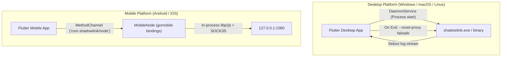

# 🎨 ShadowLink GUI (Desktop & Mobile)

This is the official Flutter interface for the **ShadowLink Decentralized VPN**, featuring a modern **Deep Obsidian & Neon Cyan** cyber aesthetic.

---

## 🏗️ Architecture

The Flutter application serves as the control plane for the dVPN. It dynamically adapts its backend integration strategy depending on the host platform:



---

## ✨ Features

- **Cyber Aesthetic UI**: Custom design system utilizing deep dark surfaces, vibrant cyan accents, and smooth micro-animations.
- **Dynamic Role Management**: Switch between Client (Entry), Relay, and Exit node configurations on desktop.
- **Live Terminal Telemetry**: Real-time log capture and stream parsing directly from the Go engine.
- **Failsafe System Proxy**: On desktop abnormal exit, invokes `shadowlink --reset-proxy` to prevent internet disconnection.
- **Strict Legal Compliance**: Enforces non-skippable EULA acceptance before initializing any networking operations.

---

## 🚀 Development & Build

### 1. Prerequisites
- **Flutter SDK**: 3.10+
- **Go**: 1.22+

### 2. Desktop Development
Before launching the desktop GUI in development mode, compile the Go binary:

```bash
# From repository root
go build -o release/shadowlink-windows-x64.exe ./cmd/shadowlink

# Navigate to GUI directory and run
cd shadowlink_gui
flutter pub get
flutter run -d windows    # Or -d macos / -d linux
```

### 3. Desktop Production Build
```bash
flutter build windows --release
flutter build macos --release
flutter build linux --release
```

### 4. Mobile Compilation (Android / iOS)
Mobile builds leverage `gomobile` to compile Go core bindings into native libraries:

```bash
# 1. Install gomobile tools
go install golang.org/x/mobile/cmd/gomobile@latest
go install golang.org/x/mobile/cmd/gobind@latest
gomobile init

# 2. Build Android AAR
mkdir -p shadowlink_gui/android/app/libs
gomobile bind -v -target=android -androidapi 21 -o shadowlink_gui/android/app/libs/mobile.aar ./mobile

# 3. Build iOS XCFramework
gomobile bind -v -target=ios,iossimulator -o shadowlink_gui/ios/Mobile.xcframework ./mobile

# 4. Build Flutter mobile app
cd shadowlink_gui
flutter build apk --release      # Android APK
flutter build ipa --no-codesign  # iOS IPA
```
