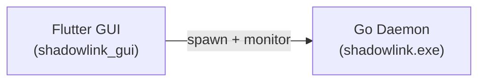

# ShadowLink GUI

This is the modern Flutter Desktop interface for the ShadowLink decentralized VPN.

## Architecture

The Flutter application acts as the control plane for the ShadowLink network. It does **not** handle any cryptographic or networking tasks itself. Instead, it manages a child process (the Go daemon) which handles the heavy lifting.



## Features
- **Cyber Aesthetic**: Deep obsidian and neon cyan design system for a professional look.
- **Role Selection**: Toggle between Entry, Relay, and Exit node roles with a single click.
- **Live Logs**: Real-time log streaming from the daemon child process.
- **Failsafe System Proxy**: On exit, the GUI guarantees the system proxy is reset (`shadowlink.exe --reset-proxy`) to prevent breaking the user's internet connection.
- **Mandatory EULA**: Legally binding EULA that users must accept before using the software.

## Development Setup

1. Ensure the Go daemon is built first (the GUI expects the binary in the `release/` directory for dev fallback, or next to the executable in production).
   ```bash
   cd ..
   go build -o release/shadowlink-windows-x64.exe ./cmd/shadowlink
   ```

2. Run the Flutter app:
   ```bash
   cd shadowlink_gui
   flutter pub get
   flutter run -d windows
   ```

## Production Build

To build the release executable for Windows:
```bash
flutter build windows
```
*(The installer will bundle `shadowlink.exe` directly beside the Flutter executable).*
